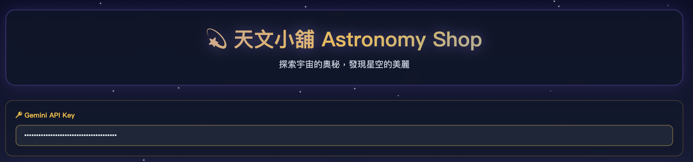
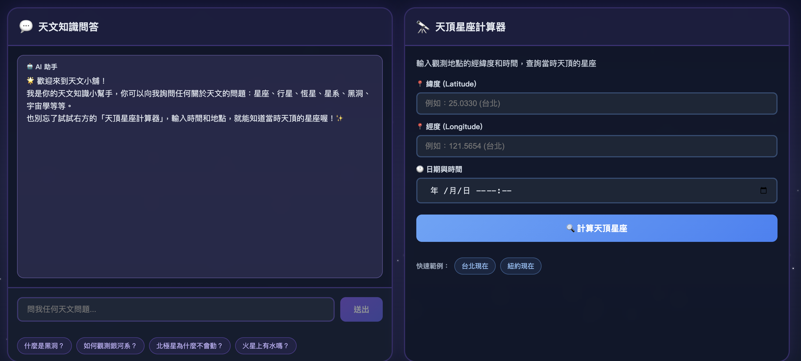

# Introduction to the Internet  

## ✏️ Course Information    
This Introduction to the Internet course focuses on understanding the evolution of the web — from Web 1.0 to Web 3.0 — through hands-on project development. Guided by practical exercises, students will learn to build, connect, and deploy modern web applications using HTML, CSS, and JavaScript within a React environment.

### 🎯 Course Objectives   
- **Hands-on Web Development:**
Encourage students to actively create and experiment with web projects to understand how Internet technologies work in practice.  
- **Technical Skill Building:**
Develop students’ proficiency in front-end development, React framework usage, API integration, and cloud deployment.

******** 
## 📚 Project & Assignments

| Project Title | Description | Links |
|----------------|--------------|--------|
| ⚙️ Taipei City Dashboard & AI API Integration | A basic static webpage built using HTML and CSS to understand the structure of early websites. | [View Code](link-to-github) · [Live Demo](link-to-deployed-site) |
| 🌐 Personal Web Integration: React & Public API Project | | [View Code](link-to-github) · Vedio Demo |
| ☁️ HW4 Cloud Deployment |  | [View Code](link-to-github) · Vedio Demo |

### HW1 : [Personal Website](https://emmahsueh.github.io/Hsueh_sWeb/)   

### HW2: 台北城市儀表板 API & AI API 串接 
**Vedio**: [解說影片](https://www.youtube.com/watch?v=JaCVpCXk--Q)   
**修改內容**：[AItest.tsx](AItest.tsx)

### 1. 台北城市儀表板 API 呼叫展示    
 - [城市建設-行道樹](https://citydashboard.taipei/embed/110/taipei)
 - [氣候變遷-空氣品質](https://citydashboard.taipei/embed/174/taipei)
 - [為民服務-道路管制](https://citydashboard.taipei/embed/177/taipei)

### 2. AI API 串接 
**主題： 💫 天文小舖 Astronomy Shop** 

**功能**： 

**1.AI 天文知識問答**   
  - 專門回答天文相關問題的 AI 助手
  - Gemini 2.5 Flash API
  - 預設問題包括：黑洞、銀河系觀測、北極星、火星 

**2.天頂星座計算器**   
  - 輸入經緯度和時間，計算該時間點天頂的星座
  - 使用 Gemini API 計算天頂星座
  - 提供快速範例按鈕（台北現在、紐約現在）   

  

