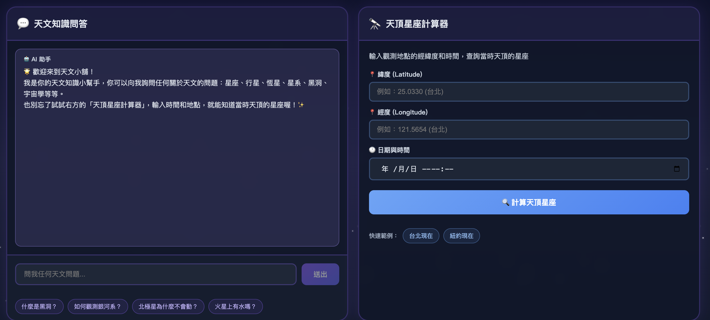

# Introduction to the Internet  

## ✏️ Course Information    
This Introduction to the Internet course focuses on understanding the evolution of the web — from Web 1.0 to Web 3.0 — through hands-on project development. Guided by practical exercises, students will learn to build, connect, and deploy modern web applications using HTML, CSS, and JavaScript within a React environment.

### 🎯 Course Objectives   
- **Hands-on Web Development:**
Encourage students to actively create and experiment with web projects to understand how Internet technologies work in practice.  
- **Technical Skill Building:**
Develop students’ proficiency in front-end development, React framework usage, API integration, and cloud deployment.

******** 
## 📚 Project & Assignments

**My personal website** -> [view website](https://emmahsueh.github.io/Hsueh_sWeb/ )    

| Project Title | Description |   Links   |
|----------------|--------------|---------------|
| ⚙️ Taipei City Dashboard & AI API Integration | 1.Retrieves and visualizes data from three different Taipei City Dashboard APIs. 2.Connects to an AI API to generate dynamic responses, displaying the results interactively on the webpage. | [View Code](AItest.tsx) · [Vedio Demo](https://www.youtube.com/watch?v=JaCVpCXk--Q) |
| 🌐 Personal Web Integration: React & Public API Project | | [View Code](link-to-github) · [Vedio Demo](https://youtu.be/X7BhsQ11RUc) |
| ☁️ HW4 Cloud Deployment |  | View Code · Vedio Demo |

### HW2: Taipei City Dashboard & AI API Integration 
**Vedio**: [解說影片](https://www.youtube.com/watch?v=JaCVpCXk--Q)   
**修改內容**：[AItest.tsx](AItest.tsx)

### 1. Taipei City Dashboard    
 - [城市建設-行道樹](https://citydashboard.taipei/embed/110/taipei)
   - curl "http://localhost:4000/api/v1/component/110/chart?city=taipei"
 - [氣候變遷-空氣品質](https://citydashboard.taipei/embed/174/taipei)
   - curl "http://localhost:4000/api/v1/component/174/chart?city=taipei"
 - [為民服務-道路管制](https://citydashboard.taipei/embed/177/taipei)
   - curl "http://localhost:4000/api/v1/component/177/chart?city=taipei"

### 2. AI API Integration 
**主題： 💫 天文小舖 Astronomy Shop** 

**功能**： 

**1.AI 天文知識問答**   
  - 專門回答天文相關問題的 AI 助手
  - Gemini 2.5 Flash API
  - 預設問題包括：黑洞、銀河系觀測、北極星、火星 

**2.天頂星座計算器**   
  - 輸入經緯度和時間，計算該時間點天頂的星座
  - 使用 Gemini API 計算天頂星座
  - 提供快速範例按鈕（台北現在、紐約現在）   

  

